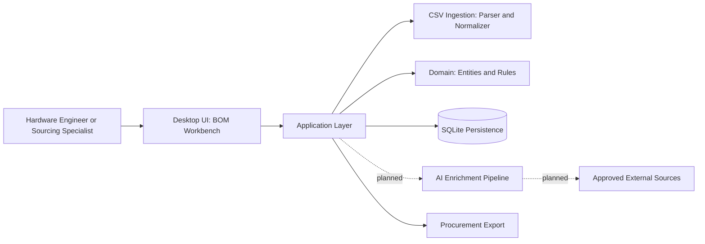
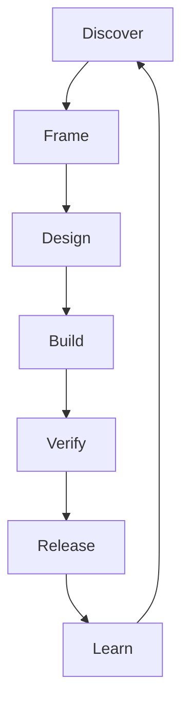

# BOM Workbench


Enterprise-grade desktop intelligence workbench for PCB Bill of Materials (BOM) ingestion, normalization, enrichment readiness, and procurement-oriented export workflows.

| Field | Value |
|---|---|
| Current Version | 0.1.0 |
| Maturity | Pre-production |
| Current Program State | Active development (Phase 1-5 foundations) |
| Runtime Baseline | Python >= 3.12 |
| Primary Stack | PySide6, SQLModel, SQLAlchemy 2, Pydantic v2 |
| License | Proprietary |
| Last Status Review | 2026-03-27 |

## Visual Overview

### Quick Navigation

- [Project Status](#2-project-status)
- [Versioning And Compatibility](#3-versioning-and-compatibility)
- [Architecture Overview](#5-architecture-overview)
- [Roadmap (High-Level)](#12-roadmap-high-level)
- [Contribution Model](#13-contribution-model)

### System Context



### Delivery Lifecycle



### Phase Progress Snapshot

| Program Phase | Status | Progress |
|---|---|---|
| Phase 1-3: Scaffold, Domain, CSV | In place | [##########] 100% |
| Phase 4-5: Persistence and UI Shell | In place | [########--] 80% |
| Phase 6-7: Import UX and Providers | In progress | [###-------] 30% |
| Phase 8-10: Enrichment, Finder, Export Polish | Planned | [#---------] 10% |

> Professional delivery note: feature completion is governed by acceptance, security, observability, and rollback gates, not only code availability.

## 1) Executive Summary

BOM Workbench is a Python desktop application for engineering and sourcing teams that need a controlled, auditable pipeline from raw KiCad-style CSV BOM files to structured, decision-ready BOM datasets.

The program is being built with an enterprise delivery model centered on:

- Deterministic data handling first, AI-assisted reasoning second
- Security, privacy, and observability by default
- Thin-slice implementation with explicit quality gates
- Shared cross-tool AI operating standards for Codex, Claude Code, and GitHub Copilot

## 2) Project Status

Current maturity: Active development, pre-production (Phase 1-5 foundations largely present in codebase).

Program status snapshot (as of 2026-03-27):

- Implemented foundations:
	- Packaging and bootstrap entrypoint
	- Domain entities/value objects/enums core
	- CSV parsing, header matching, row normalization primitives
	- SQLite persistence primitives and repository scaffolding
	- Qt shell, navigation skeleton, page placeholders, inspector scaffolding
	- Unit, integration, and UI smoke test scaffolds with fixture coverage
- Planned but not yet complete for production:
	- Full provider integration and secrets governance hardening
	- End-to-end enrichment pipeline with policy gates
	- Part replacement workflow with human-review controls
	- Production export guarantees and release rollout mechanics

Delivery posture:

- Product scope is documented and split into progressive slices
- Enterprise hard-gate planning artifacts are present under the implementation plan set
- Repository currently favors low-risk scaffolding and discovery over broad feature completion

## 3) Versioning And Compatibility

### 3.1 Product Version

- Current package version: 0.1.0
- Stage: pre-1.0 (no API stability guarantees yet)
- Version source of truth:
	- pyproject metadata: [pyproject.toml](pyproject.toml)
	- runtime package version constant: [src/bom_workbench/__init__.py](src/bom_workbench/__init__.py)

### 3.2 Semantic Versioning Policy

This project follows SemVer intent:

- 0.y.z: rapid iteration; breaking changes may occur between minor releases
- 1.y.z and above: stable contracts, explicit deprecation windows

### 3.3 Runtime And Toolchain Matrix

| Component | Current Baseline |
|---|---|
| Python | >= 3.12 |
| Build backend | hatchling >= 1.26 |
| UI framework | PySide6 |
| Async integration | qasync |
| Data model | pydantic v2 + SQLModel |
| Persistence | SQLite via SQLAlchemy 2 |
| Test stack | pytest, pytest-asyncio, pytest-cov |
| Static quality | ruff, mypy |

## 4) Core Capabilities (Current + Target)

### 4.1 BOM Ingestion (Current foundation available)

- CSV encoding detection with safe fallback behavior
- Delimiter detection with tolerant fallback rules
- Header normalization and duplicate-header warnings
- Row preservation, including malformed/extra-column visibility

### 4.2 Domain And Persistence (Current foundation available)

- Canonical BOM row and project domain entities
- SQLModel-backed SQLite engine/session setup
- Import pipeline roundtrip persistence tested via integration flow

### 4.3 Desktop Workbench UX (Current shell available)

- Main shell window with structured page stack
- Navigation rail and inspector panel scaffolding
- Headless bootstrap mode for CI/smoke scenarios

### 4.4 Intelligence Workflow (Planned)

- Provider abstraction and secure key handling
- Deterministic evidence retrieval + model reasoning
- Job orchestration with resumable state transitions
- Human-reviewed part replacement decisions

### 4.5 Export Workflow (Planned hard requirement)

- Reproducible export contracts focused on procurement-ready format
- Required primary columns:
	- Designator
	- Comment
	- Footprint
	- LCSC LINK
	- LCSC PART #

## 5) Architecture Overview

The codebase follows a layered, domain-forward structure aligned with hexagonal principles.

High-level layers:

- Domain:
	- Business entities, enums, normalization and matching contracts
- Infrastructure:
	- CSV ingestion adapters
	- Persistence adapters (SQLite/SQLModel)
- UI:
	- Desktop shell, pages, widgets, inspector views

Representative implementation roots:

- [src/bom_workbench/domain](src/bom_workbench/domain)
- [src/bom_workbench/infrastructure](src/bom_workbench/infrastructure)
- [src/bom_workbench/ui](src/bom_workbench/ui)

## 6) Repository Layout

| Path | Responsibility |
|---|---|
| [src/bom_workbench](src/bom_workbench) | Application package |
| [tests](tests) | Unit, integration, and UI smoke test suites |
| [tests/fixtures](tests/fixtures) | BOM CSV fixtures (valid, malformed, variant headers/encodings) |
| [instructions/plan](instructions/plan) | Enterprise implementation plan and governance gates |
| [.ai](.ai) | Shared AI operating system and delivery model docs |
| [resources/themes](resources/themes) | UI theming resources |

## 7) Enterprise Planning And Governance

This repository includes explicit planning artifacts to support enterprise-grade execution.

Primary planning index:

- [instructions/plan/00-plan-index.md](instructions/plan/00-plan-index.md)

Key governance dimensions covered:

- Product scope and acceptance criteria
- External data source and compliance guardrails
- State machine and workflow contracts
- AI evaluation and human review policy
- Data migration and upgrade policy
- Release, rollback, and incident readiness
- SLOs, observability, and cost controls

Enterprise hard-gate workflow references:

- [instructions/plan/12-implementation-phases.md](instructions/plan/12-implementation-phases.md)
- [instructions/plan/13-product-scope-and-acceptance.md](instructions/plan/13-product-scope-and-acceptance.md)

## 8) Security, Privacy, And Compliance Posture

Current posture is framework-first with staged hardening:

- Secrets handling and privacy controls are part of planned provider integration gates
- Logging is structured and intended for safe operational diagnostics
- Governance docs define non-negotiable controls for source approval, grounding, and rollback safety

Important note:

- This project is currently pre-production; do not treat current default configuration as production-hardened until all security and release gates are explicitly passed.

## 9) Quality Strategy

Quality is treated as a delivery gate, not a follow-up task.

Current quality assets:

- Unit tests for domain/CSV components
- Integration pipeline verification for import + persistence roundtrip
- UI smoke tests for bootstrap/headless/window instantiation
- Static quality tooling configured via ruff and mypy

Quality expectation for production readiness:

- Functional correctness across core workflows
- Security and privacy review completion
- Observability and incident response readiness
- Repeatable release and rollback verification

## 10) Installation And Local Development

### 10.1 Prerequisites

- Python 3.12+
- A virtual environment manager of your choice

### 10.2 Install

```bash
python -m venv .venv
.venv\Scripts\activate
python -m pip install --upgrade pip
python -m pip install -e .
```

Install dev tooling:

```bash
python -m pip install -e .[dev]
```

### 10.3 Run

```bash
python -m bom_workbench
```

Console script entrypoint:

```bash
bom-workbench
```

Headless mode:

```bash
bom-workbench --headless
```

## 11) Testing And Checks

Run tests:

```bash
pytest
```

Run lint and type checks:

```bash
ruff check .
mypy
```

## 12) Roadmap (High-Level)

Roadmap follows phased implementation and gate validation:

1. Stabilize import-to-storage UX flow and acceptance traceability
2. Introduce provider integration with source/compliance controls
3. Deliver grounded enrichment pipeline with state and observability contracts
4. Implement explainable replacement workflow with mandatory human confirmation
5. Finalize export guarantees, release process, and rollback drills

Detailed phase model:

- [instructions/plan/12-implementation-phases.md](instructions/plan/12-implementation-phases.md)

## 13) Contribution Model

This repository uses a shared enterprise AI delivery model.

Start with:

- [AGENTS.md](AGENTS.md)
- [CLAUDE.md](CLAUDE.md)
- [.github/copilot-instructions.md](.github/copilot-instructions.md)
- [.ai/README.md](.ai/README.md)

Expected contribution behavior:

- Keep changes small, reviewable, and test-backed
- Make assumptions explicit when business context is incomplete
- Preserve security, observability, and rollback discipline in every feature slice

## 14) License And Ownership

- License classification: Proprietary
- Project owner: F2X

## 15) Contact And Program Notes

Known product description currently tracked in planning context:

- AI BOM Finder for PCB making

As business context matures, this README should be updated to include:

- official support matrix
- release channel policy
- escalation contacts
- compliance mapping and data retention policy
